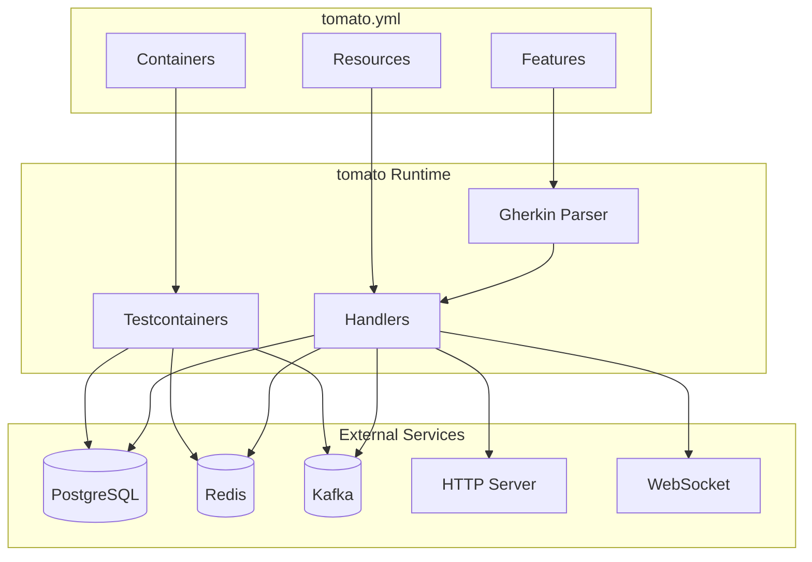
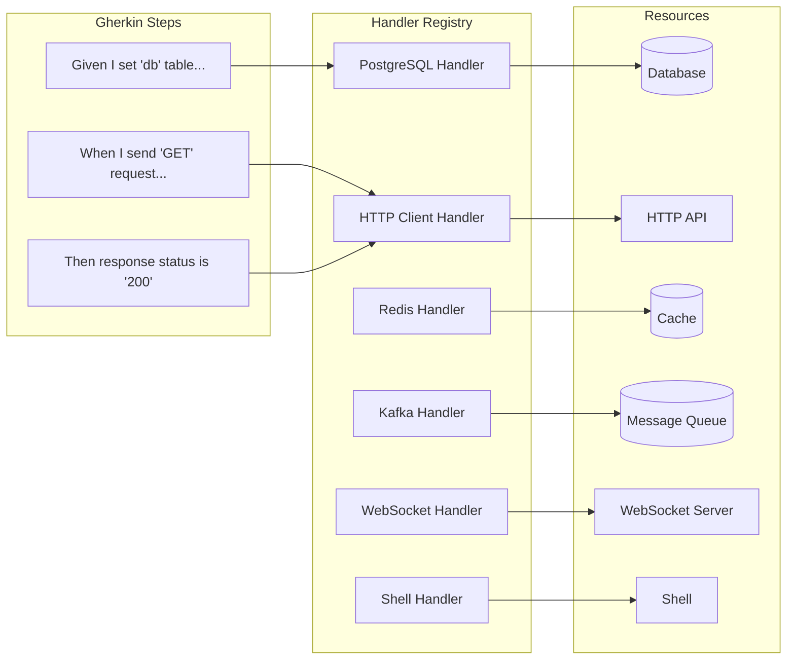
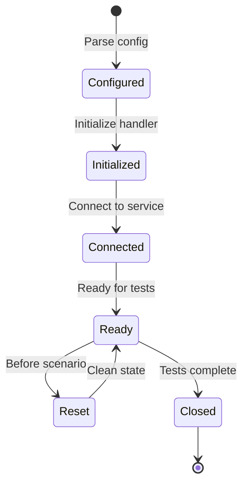
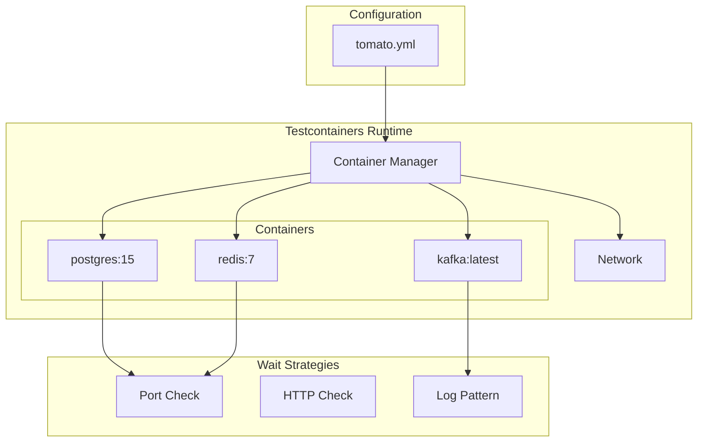
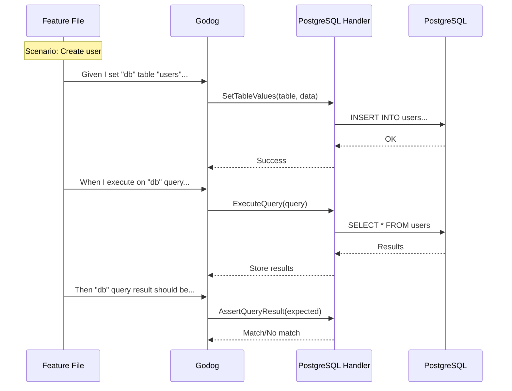
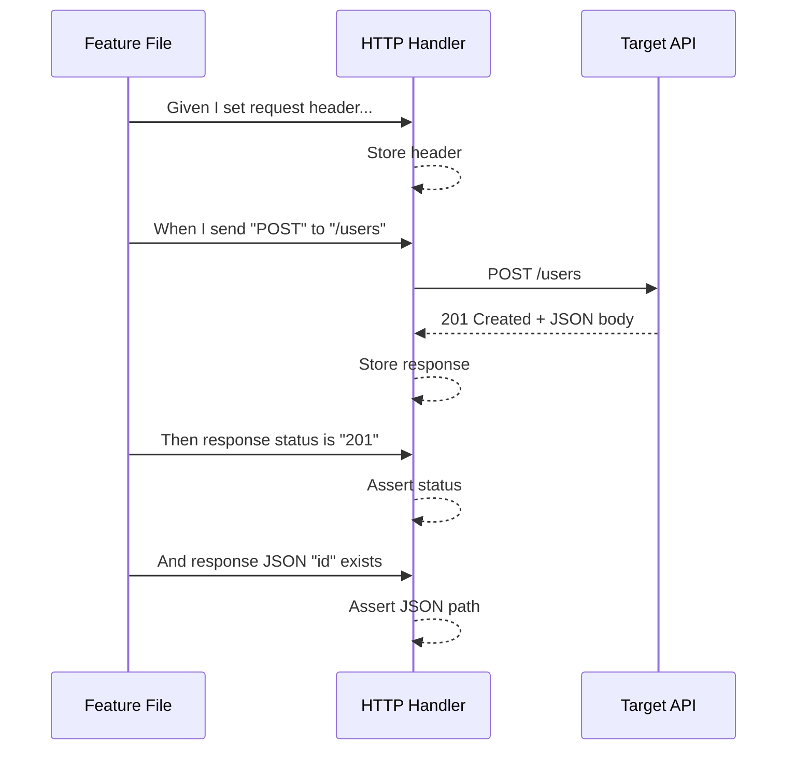
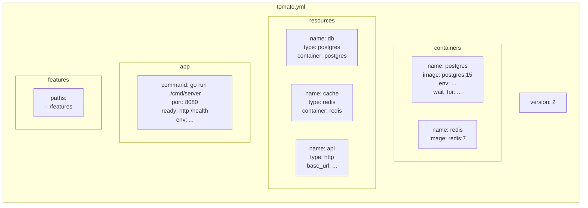
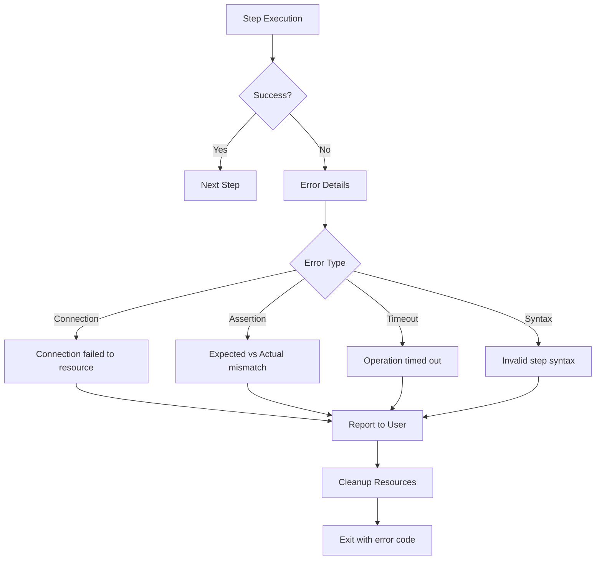

# Architecture

This page provides an overview of tomato's internal architecture and how components interact during test execution.

## High-Level Overview

tomato is designed around three core concepts:

1. **Containers** - Docker containers managed via Testcontainers
2. **Resources** - Abstractions over external services (databases, APIs, message queues)
3. **Handlers** - Step definitions that interact with resources

## Test Execution Flow

When you run `tomato run`, the following sequence occurs:

```mermaid
sequenceDiagram
    participant User
    participant CLI
    participant Config
    participant TC as Testcontainers
    participant App as Application
    participant Handler
    participant Godog

    User->>CLI: tomato run
    CLI->>Config: Parse tomato.yml

    rect rgb(40, 40, 40)
        Note over TC: Container Setup
        Config->>TC: Start containers
        TC-->>TC: Wait for readiness
        TC-->>Config: Container endpoints
    end

    rect rgb(40, 40, 40)
        Note over App: App Setup (optional)
        Config->>App: Start application
        App-->>App: Wait for ready check
    end

    rect rgb(40, 40, 40)
        Note over Handler: Resource Setup
        Config->>Handler: Initialize handlers
        Handler-->>Handler: Connect to services
    end

    rect rgb(40, 40, 40)
        Note over Godog: Test Execution
        CLI->>Godog: Run features
        loop Each Scenario
            Godog->>Handler: Reset resources
            loop Each Step
                Godog->>Handler: Execute step
                Handler-->>Godog: Result
            end
        end
    end

    Godog-->>CLI: Test results
    CLI->>TC: Stop containers
    CLI->>App: Stop application
    CLI-->>User: Exit code
```

## Handler Architecture

Handlers are responsible for translating Gherkin steps into actions against resources:

## Resource Lifecycle

Each resource follows a consistent lifecycle:

## Container Orchestration

tomato uses Testcontainers to manage Docker containers:

## Data Flow Example

Here's how a typical database test scenario flows through the system:

## HTTP Request/Response Flow

## Configuration Structure

## Error Handling

When a step fails, tomato provides detailed error information:

