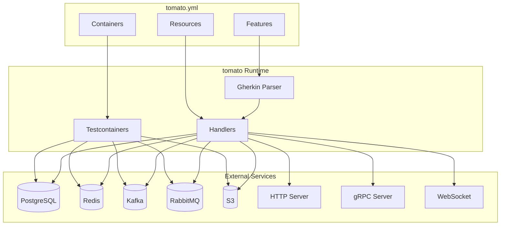
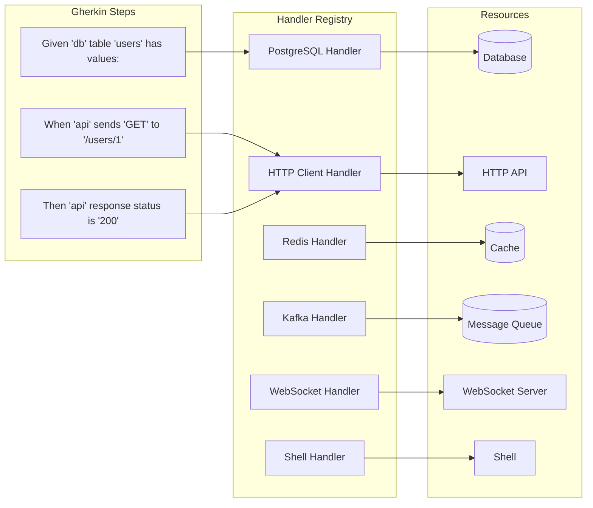
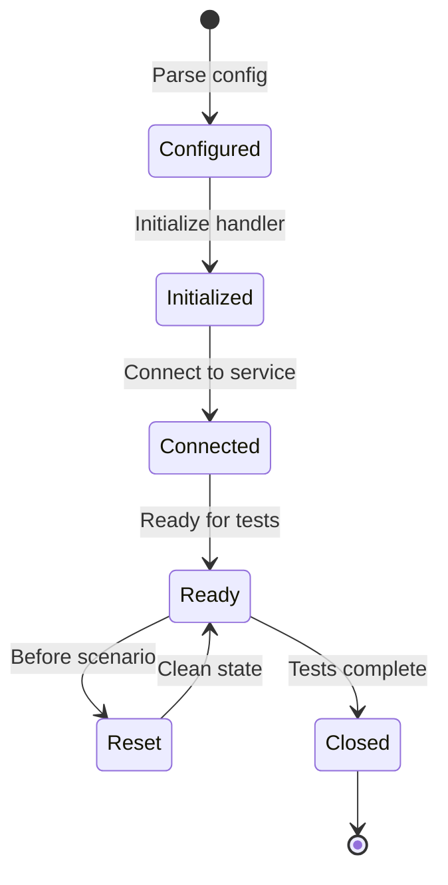
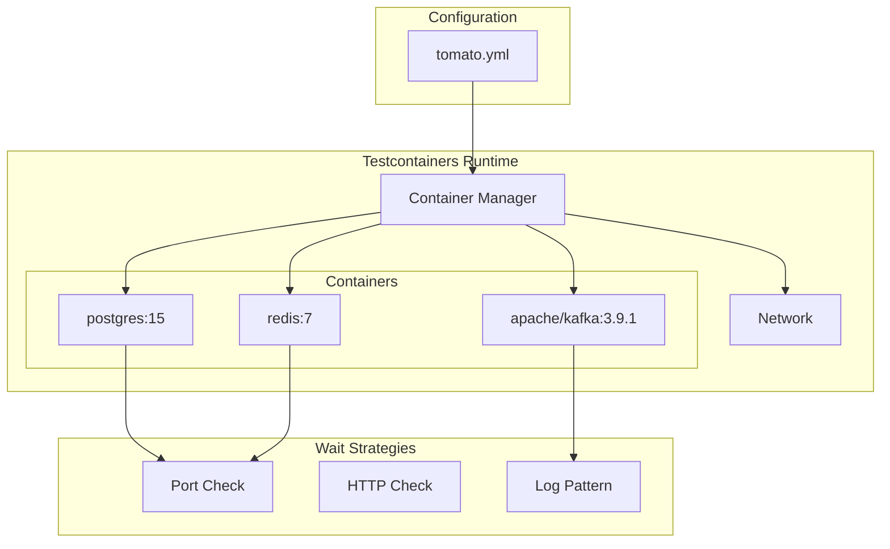
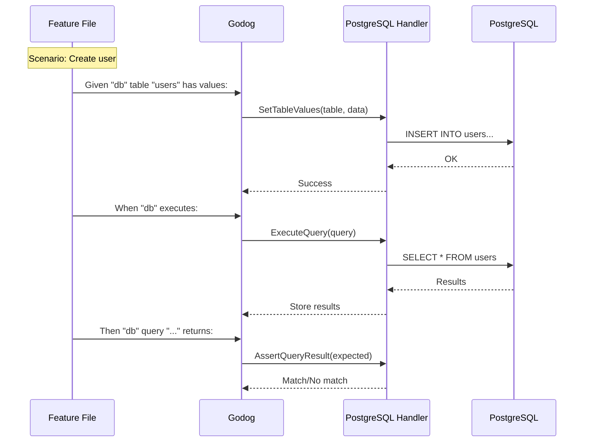
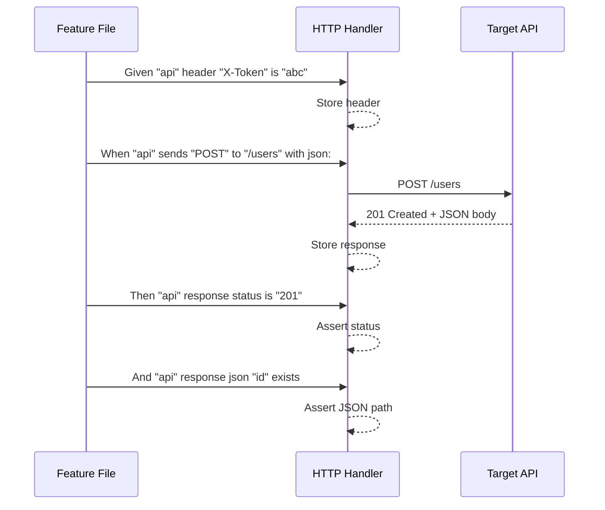
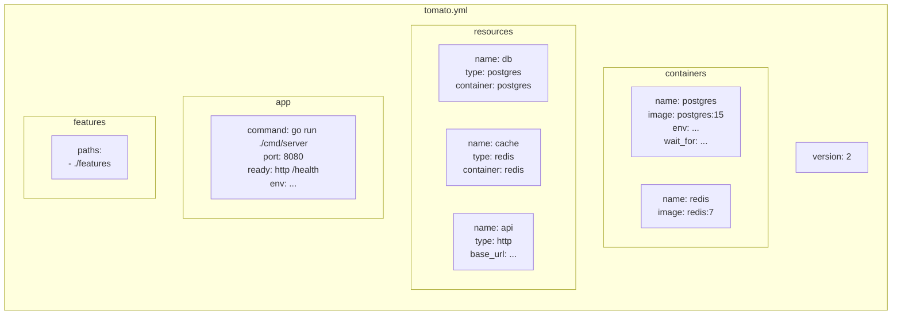
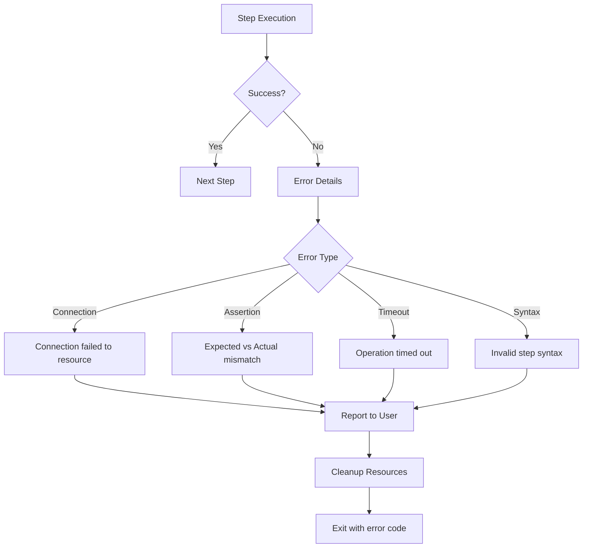

# Architecture

This page provides an overview of tomato's internal architecture and how components interact during test execution.

## High-level overview

tomato is designed around three core concepts:

1. **Containers** - Docker containers managed via Testcontainers
2. **Resources** - Abstractions over external services (databases, APIs, message queues)
3. **Handlers** - Step definitions that interact with resources

## Where the code lives

| Package | Responsibility |
|---------|----------------|
| `command/` | One file per CLI command, plus the step-docs generator |
| `internal/config` | `tomato.yml` parsing, defaults, validation, preset expansion |
| `internal/container` | Container lifecycle via Testcontainers, wait strategies, logs |
| `internal/apprunner` | Starting the application under test, `app.env` templating |
| `internal/handler` | One file per resource type, each with its step definitions |
| `internal/runner` | godog wiring, hooks, tag filtering, reset between scenarios |
| `internal/formatter` | Console, JUnit and Cucumber report output |
| `internal/presets` | Files copied into preset containers (the MSK IAM jar) |
| `internal/runlog` | Per-run log directory under `.tomato/runs/` |

A resource type is registered in exactly one place, `handlerFactories` in
`internal/handler/registry.go`.

## Test execution flow

When you run `tomato run`, the following sequence occurs:

```mermaid
sequenceDiagram
    participant User
    participant CLI
    participant Config
    participant TC as Testcontainers
    participant App as Application
    participant Handler
    participant Godog

    User->>CLI: tomato run
    CLI->>Config: Parse tomato.yml

    rect rgb(40, 40, 40)
        Note over TC: Container Setup
        Config->>TC: Start containers
        TC-->>TC: Wait for readiness
        TC-->>Config: Container endpoints
    end

    rect rgb(40, 40, 40)
        Note over Handler: Resources the app depends on
        Config->>Handler: Init app-env providers (aws STS)
        Handler-->>Config: Environment for the app
    end

    rect rgb(40, 40, 40)
        Note over App: App Setup (optional)
        Config->>App: Start application
        App-->>App: Wait for ready check
    end

    rect rgb(40, 40, 40)
        Note over Handler: Resource Setup
        Config->>Handler: Initialize remaining handlers
        Handler-->>Handler: Connect to services
    end

    rect rgb(40, 40, 40)
        Note over Godog: Test Execution
        CLI->>Godog: Run features
        loop Each Scenario
            Godog->>Handler: Reset resources
            loop Each Step
                Godog->>Handler: Execute step
                Handler-->>Godog: Result
            end
        end
    end

    Godog-->>CLI: Test results
    CLI->>App: Stop application
    CLI->>Handler: Close resources
    CLI->>TC: Stop containers
    CLI-->>User: Exit code
```

## Handler architecture

Handlers are responsible for translating Gherkin steps into actions against resources:

## Resource lifecycle

Each resource follows a consistent lifecycle:

## Container orchestration

tomato uses Testcontainers to manage Docker containers:

## Data flow example

Here's how a typical database test scenario flows through the system:

## HTTP request/response flow

## Configuration structure

## Error handling

When a step fails, tomato provides detailed error information:

