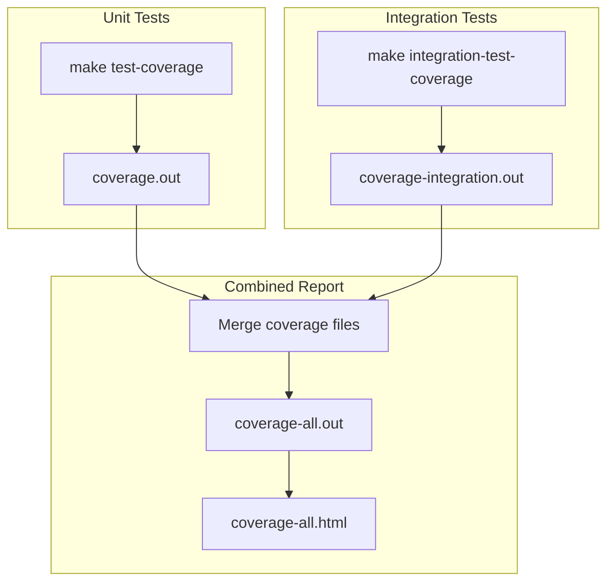

# Integration Test Coverage

This page explains how tomato collects integration test coverage and how you can use it in your development workflow.

## Overview

Tomato uses Go's built-in coverage instrumentation (introduced in Go 1.20) to collect coverage data when running integration tests. This approach, sometimes called the "Cloudflare technique," builds a coverage-instrumented binary and collects coverage data at runtime.

```mermaid
flowchart LR
    subgraph Build["Build Phase"]
        SRC[Source Code] --> BUILD["go build -cover"]
        BUILD --> BIN[tomato-coverage binary]
    end

    subgraph Run["Execution Phase"]
        BIN --> ENV["GOCOVERDIR=./coverage"]
        ENV --> TESTS[Run Integration Tests]
        TESTS --> DATA[Binary Coverage Data]
    end

    subgraph Report["Report Phase"]
        DATA --> CONVERT["go tool covdata"]
        CONVERT --> OUT[coverage-integration.out]
        OUT --> HTML["go tool cover -html"]
        HTML --> REPORT[coverage-integration.html]
    end
```



## Quick Start

Run integration tests with coverage locally:

```bash
make integration-test-coverage
```

This generates:
- `coverage-integration.out` - Coverage data in text format
- `coverage-integration.html` - Interactive HTML report

## How It Works

### 1. Build Phase

The binary is compiled with coverage instrumentation:

```bash
go build -cover -covermode=atomic -coverpkg=./... -o ./bin/tomato-coverage .
```

| Flag | Purpose |
|------|---------|
| `-cover` | Enable coverage instrumentation |
| `-covermode=atomic` | Thread-safe coverage collection |
| `-coverpkg=./...` | Instrument all packages |

### 2. Execution Phase

The instrumented binary runs with `GOCOVERDIR` set:

```bash
mkdir -p ./coverage
GOCOVERDIR=./coverage ./bin/tomato-coverage run -c ./tests/tomato.yml
```

During execution, coverage data is written as binary protocol buffer files to the `./coverage` directory.

### 3. Report Generation

The binary coverage data is converted to text format and then to HTML:

```bash
# Convert to text format
go tool covdata textfmt -i=./coverage -o=coverage-integration.out

# Generate HTML report
go tool cover -html=coverage-integration.out -o coverage-integration.html
```

## CI/CD Integration

Integration test coverage runs automatically on **pull requests** via GitHub Actions.

### What Happens on PR

1. The CI builds a coverage-instrumented binary
2. Runs integration tests with coverage collection
3. Posts a comment on the PR with coverage results

### Coverage Comment Format

The bot posts a comment showing:
- Total coverage percentage with color-coded indicator
- Coverage breakdown by package
- Detailed file-level breakdown for `internal/handler`

Example output:

**By Package**

| | Package | Functions | Coverage |
|---|---------|-----------|----------|
| 🟢 | `root` | 1 | 100.0% |
| 🟡 | `internal/config` | 6 | 67.3% |
| 🟠 | `internal/apprunner` | 28 | 45.2% |
| 🔴 | `command` | 80 | 2.9% |

**Handler Files (`internal/handler`)**

| | File | Functions | Coverage |
|---|------|-----------|----------|
| 🟡 | `kafka.go` | 32 | 76.5% |
| 🟡 | `rabbitmq.go` | 38 | 70.9% |
| 🟡 | `redis.go` | 38 | 66.4% |
| 🟠 | `postgres.go` | 21 | 53.2% |
| 🔴 | `http_client.go` | 55 | 29.3% |
| 🔴 | `websocket_server.go` | 18 | 0.0% |

Coverage indicators:
- 🟢 80%+ coverage
- 🟡 60-80% coverage
- 🟠 40-60% coverage
- 🔴 Below 40% coverage

### Workflow Configuration

The integration test coverage job is defined in `.github/workflows/ci.yml`:

```yaml
integration-test-coverage:
  runs-on: ubuntu-latest
  if: github.event_name == 'pull_request'
  steps:
    - name: Checkout
      uses: actions/checkout@v4

    - name: Set up Go
      uses: actions/setup-go@v5
      with:
        go-version: "1.24"

    - name: Download dependencies
      run: go mod download

    - name: Run integration tests with coverage
      run: make integration-test-coverage

    - name: Generate coverage summary
      id: coverage
      run: |
        # Get total coverage percentage
        TOTAL=$(go tool cover -func=coverage-integration.out | grep total | awk '{print $3}')
        echo "total=$TOTAL" >> $GITHUB_OUTPUT

        # Generate coverage table by package (package|functions|avg%)
        TABLE=$(go tool cover -func=coverage-integration.out | grep -v "total:" | awk '...')
        echo "table<<EOF" >> $GITHUB_OUTPUT
        echo "$TABLE" >> $GITHUB_OUTPUT
        echo "EOF" >> $GITHUB_OUTPUT

    - name: Post coverage comment
      uses: actions/github-script@v7
      # Builds markdown table and posts to PR
```

## Combined Coverage

To get combined unit test and integration test coverage:

```bash
make coverage-all
```

This runs both test types and merges the results into:
- `coverage-all.out` - Combined coverage data
- `coverage-all.html` - Combined HTML report



## Make Targets Reference

| Target | Description |
|--------|-------------|
| `make integration-test` | Run integration tests without coverage |
| `make integration-test-coverage` | Run integration tests with coverage |
| `make test-coverage` | Run unit tests with coverage |
| `make coverage-all` | Run both and combine coverage |
| `make clean` | Remove all coverage artifacts |

## Generated Files

| File | Description |
|------|-------------|
| `./bin/tomato-coverage` | Coverage-instrumented binary |
| `./coverage/` | Binary coverage data directory |
| `coverage-integration.out` | Integration coverage (text format) |
| `coverage-integration.html` | Integration coverage report |
| `coverage.out` | Unit test coverage (text format) |
| `coverage.html` | Unit test coverage report |
| `coverage-all.out` | Combined coverage (text format) |
| `coverage-all.html` | Combined coverage report |

## Technical Details

### Why This Approach?

Traditional Go coverage (`go test -cover`) only works for unit tests. For integration tests where you run a compiled binary, you need:

1. A coverage-instrumented binary (via `go build -cover`)
2. A way to collect coverage at runtime (`GOCOVERDIR`)
3. Tools to convert the binary format (`go tool covdata`)

This technique allows measuring coverage of code paths exercised by end-to-end tests, which unit tests might miss.

### The Test Wrapper

The file `main_coverage_test.go` provides an alternative entry point for coverage collection:

```go
//go:build integration

package main

import (
    "os"
    "testing"
)

func TestMainWithCoverage(t *testing.T) {
    if len(os.Args) < 2 {
        t.Skip("No arguments provided, skipping integration test")
    }
    main()
}
```

This allows running the binary through `go test` for coverage collection when needed.

### Requirements

- Go 1.20 or later (for `go build -cover` and `go tool covdata`)
- Docker (for running integration test containers)

## Troubleshooting

### Coverage is 0% or very low

Ensure the integration tests actually exercise the code paths. Check that:
- Containers are starting correctly
- Feature files are being found and executed
- No early failures prevent test execution

### Missing coverage data

If `./coverage/` is empty after running:
- Verify `GOCOVERDIR` is set correctly
- Check the binary was built with `-cover` flag
- Ensure the binary exits cleanly (coverage is written on exit)

### HTML report not generated

If `coverage-integration.html` is missing:
- Verify `coverage-integration.out` was created
- Check for errors in the `go tool cover` command
- Ensure you have write permissions in the directory
